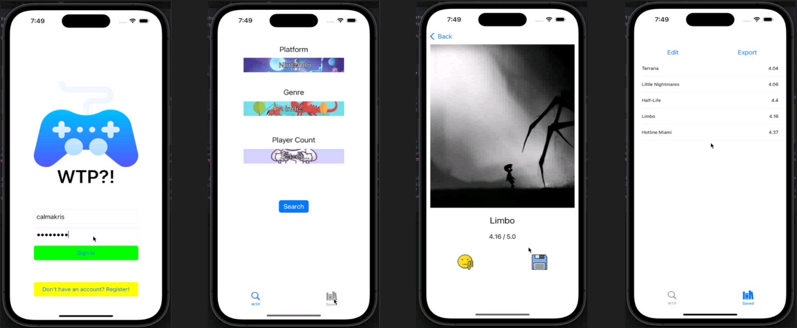

### WhatToPlay

* Ai Chan Tran <aichantran@csu.fullerton.edu>
* Nicolas Vasquez <nickvas67@csu.fullerton.edu>
* Ryan Christopher L. Valenton <RCValenton@csu.fullerton.edu>
* Kristofer Calma <calmakris@csu.fullerton.edu>

##### WHAT WE LEARNED
* How to utilize callbacks to transition between multiple views within the application
* How to internalize and localize an application according to the user's desired language
* How to utilize RESTful POST/GET requests within the swift programming language
* How to persist application settings, database information, and exported files after the termination of the application
* How to utilize text input/delegation to restrict the user's input to specified characters
* How to utilize the storyboard layout within XCode to create view controllers and their corresponding interactive assets
* How to log changes made within the application to the terminal for debugging
* Tools: Swift, Cocoapods, XCode, MacOS Terminal, Ruby

##### HOW TO RUN THE PROJECT
* The application runs through the XCode 14.0.1 environment
1. Download the 'WhatToPlay' folder from the repository
2. With XCode, open the 'WhatToPlay' folder
3. For the best viewing experience, set the ios simulator on the top-middle to be iphone11/iphone pro max (App can still be viewed via iPad if desired)
4. On the top-left click the play button
5. Navigate to the application on the simulated iphone and have fun!

##### In case of error, please see below

Make sure to open WhatToPlay.xcworkspace instead of WhatToPlay.xcodeproj 
If cocoapods installation and set up is require, then run: 
-Brew install cocoapods 
while in the project's folder, run: 
-pod init 
then, run: 
-open Podfile 
^ before the last 'end', add in: 
-pod 'DropDown' 
close text, then: 
-pod install 
now run WhatToPlay.xcworkspace 
 
if you encountererrors while trying to do pod init: 
-Make sure you have ruby installed (check for version using 'ruby -v') 
run: 
-echo 'export 
PATH="/usr/local/opt/ruby/bin:/usr/local/lib/ruby/gems/2.7.0/bin:$PATH"'>> 
~/.zshrc  
replace the version number with the one you have, then do: 
-source ~/.zshrc 
then run: 
-sudo gem install -n /usr/local/bin cocoapods 
 
For detailed instructions, visit:
https://stackoverflow.com/questions/51126403/you-dont-have-write-permissions-for-the-library-ruby-gems-2-3-0-directory-ma 
 
